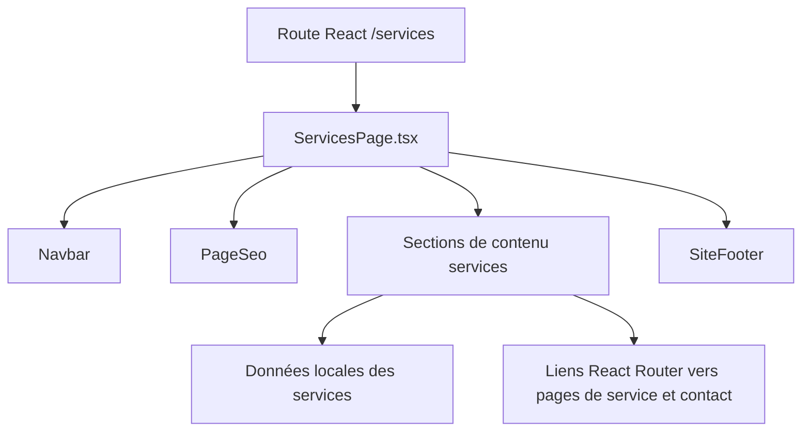
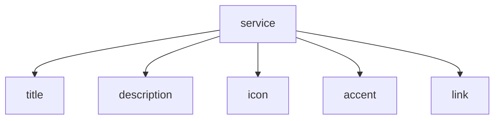

## 1. Architecture


## 2. Description technique
- Frontend : React 18 + TypeScript + Tailwind CSS + React Router
- Structure : page React unique réécrite dans `src/pages/ServicesPage.tsx`
- Réutilisation : `Navbar`, `PageSeo`, `SiteFooter`
- Animations : classes Tailwind, transitions CSS, éventuelle réutilisation de `useScrollReveal` si cohérent avec le nouveau design

## 3. Définition des routes
| Route | Rôle |
|---|---|
| /services | Afficher la nouvelle page éditoriale des expertises |
| /services/strategie-marketing-rebranding | Détail du service stratégie marketing |
| /services/creation-contenu-community-management | Détail du service contenu |
| /services/publicite-digitale | Détail du service publicité |
| /services/seo | Détail du service SEO |
| /services/marketing-influence | Détail du service influence |
| /services/media-publicite-offline | Détail du service offline |
| /contact | Page de conversion principale depuis le CTA |

## 4. API
Aucune API backend n'est requise pour cette refonte. Le contenu est statique et rendu côté frontend.

## 5. Modèle de données
### 5.1 Modèle logique


### 5.2 Définition TypeScript visée
```ts
type ServiceItem = {
  title: string
  description: string
  icon: string
  accent: 'primary' | 'secondary'
  link: string
}
```
