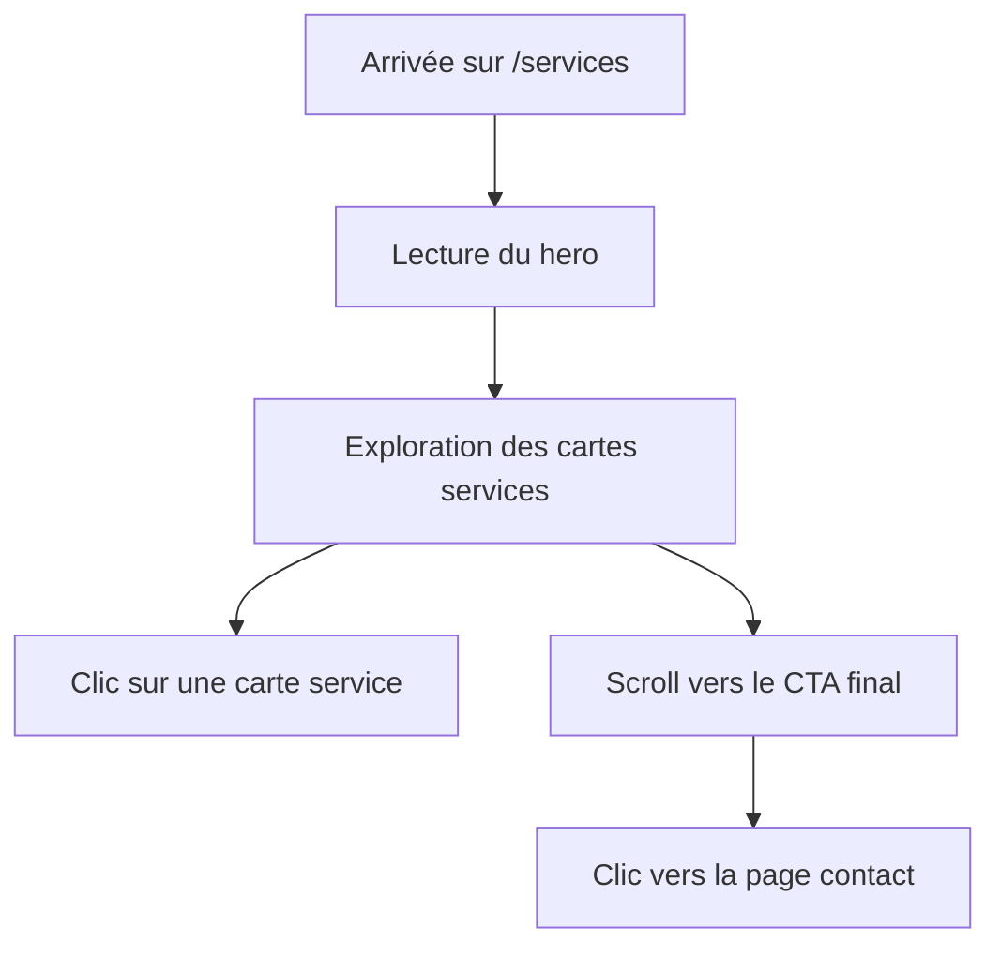

## 1. Vue d'ensemble du produit
Remplacer entièrement la page `Services` actuelle par une nouvelle page éditoriale haut de gamme inspirée de la maquette HTML fournie par l'utilisateur.
- L'objectif est d'obtenir une page plus premium, plus claire visuellement et plus fidèle à l'identité WE YAN DIGITAL.
- La valeur attendue est une meilleure perception de marque, une lecture plus fluide des expertises et un meilleur passage vers la prise de contact.

## 2. Fonctionnalités principales

### 2.1 Module fonctionnel
1. **Page Services** : hero éditorial, grille d'expertises, CTA final, intégration avec la navigation du site

### 2.2 Détail de la page
| Nom de la page | Nom du module | Description de la fonctionnalité |
|---|---|---|
| Services | App bar | Affiche la barre de navigation déjà utilisée sur le site pour conserver la cohérence globale |
| Services | Hero | Présente le titre "Nos Expertises Digitales" avec une mise en page centrée et un fond décoratif léger |
| Services | Grille de services | Affiche 6 cartes services avec icône, titre, texte court et lien d'exploration |
| Services | CTA | Met en avant un bloc d'appel à l'action menant vers la page contact |
| Services | Footer | Conserve le footer du projet pour ne pas casser la cohérence avec le reste du site |

## 3. Parcours principal
L'utilisateur arrive sur la page `Services`, parcourt rapidement le hero, découvre les six expertises, clique sur un service précis ou poursuit vers le CTA final pour contacter l'agence.

## 4. Design de l'interface
### 4.1 Style visuel
- Couleurs principales : fond clair raffiné, bleu grisé premium, accent orange énergique
- Style des boutons : arrondis pleins, lisibles, avec contraste fort
- Typographie : affichage très marqué pour les titres, corps lisible et élégant
- Style de layout : desktop-first, hero centré, grille de cartes régulière, CTA large
- Iconographie : pictogrammes sobres de type Material ou équivalent déjà disponible dans le projet

### 4.2 Vue d'ensemble de la page
| Nom de la page | Nom du module | Éléments UI |
|---|---|---|
| Services | Hero | Grand titre, sous-titre centré, glow décoratif en fond |
| Services | Cartes services | Cartes claires avec bordure douce, halo d'accent, animation hover, lien Explorer |
| Services | CTA | Bloc sombre ou contrasté, texte fort, bouton principal vers contact |
| Services | Footer | Footer existant du site |

### 4.3 Responsive
- Approche desktop-first
- Passage en 3 colonnes desktop, 2 colonnes tablette, 1 colonne mobile
- Conservation de bons espacements et d'une lisibilité forte sur petits écrans
